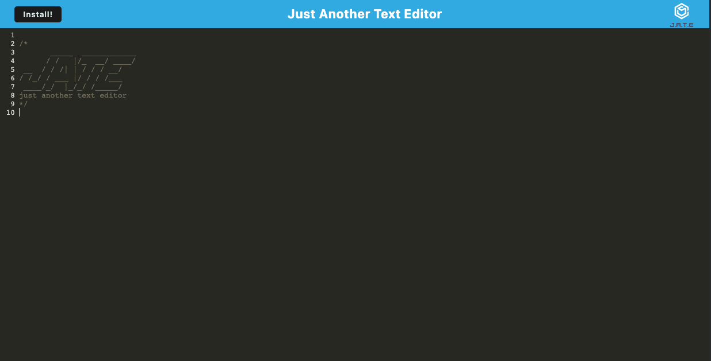

# J.A.T.E Notetaker App

[Use this app live!](https://secret-atoll-62383.herokuapp.com/)

## Description

J.A.T.E is a text editing app designed to work online and off line on the user's device. This app allows the quick taking of notes and will automatically save the user's work each time the app lose's focus.

## Table of Contents
  [Description](#description)

  [Installation](#installation)

  [Technologies](#technologies)

  [Questions](#questions)
  
  [License](#license)

## Installation
This app is deployed online at: https://secret-atoll-62383.herokuapp.com/. 

When you visit the app online there is also an option to install it as a PWA by using the install button on the top left, or the install prompt in the url bar in Google Chrome.

## Technologies
> Express
> Webpack
> iDB

## Questions

Created by RyanMcd29. If you have any questions about this project please contact me at ryan.mcdiarmid45@gmail.com.

## License

Licensed for use under MIT for more information please see license in repo.